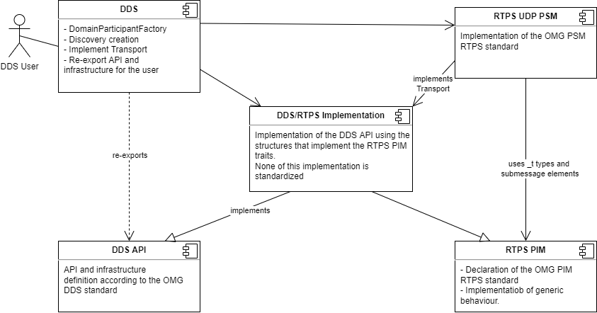
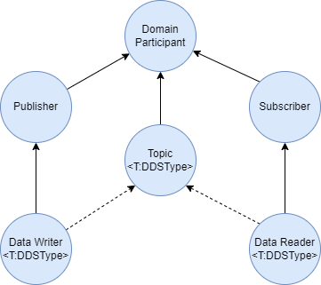
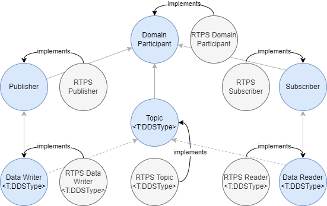

# S2E Rust DDS and RTPS

## Introduction

This repository contains the S2E implementation of the OMG [Data Distribution Services (DDS)](https://www.omg.org/omg-dds-portal/) and [Real-time Publisher-Subscriber (RTPS)](https://www.omg.org/spec/DDSI-RTPS/About-DDSI-RTPS/) protocols using the [Rust programming language](https://www.rust-lang.org/).

The aim of this project was to create a high-quality Rust implementation of the minimum DDS profile. For high-quality it is meant that the implementation should be done using stable Rust and ideally without unsafe code and with large unit test code coverage. Additionally it is desirable to keep the implementation modular to the extent that different protocols and communication channels can be added with a reasonable amount of effort.

## High-level crate architecture

This section briefly describes the high-level architecture at crate level. The implementation is divided in 5 crates as shown in the figure below.



The crates are divided as:

1. **DDS API**: This crate implements the [OMG DDS standard](https://www.omg.org/spec/DDS/1.4/PDF). It is structured following the standard and is essentially divided in two parts:
    1. Infrastructure: The infrastructure folder defines and implements functional components that are used in the API. Examples of this are Quality of Service (QoS) structures and basic listener and entity traits. Built-in topic types are also defined as part of the infrastructure since their definition is done as part of the standard.
    2. API: The remaining folders contain the API definition using traits.
2. **RTPS**: This crate implements the Platform-Independent Model (PIM) of the [OMG RTPS standard](https://www.omg.org/spec/DDSI-RTPS/2.3/PDF).
3. **RTPS transport UDP**: This crate implements the standardized UDP Platform-Specific Model (PSM) of the [OMG RTPS standard](https://www.omg.org/spec/DDSI-RTPS/2.3/PDF).
4. **DDS/RTPS implementation**: This crate provides an implementation of the DDS API using RTPS. This implementation is not standardized.
5. **DDS**: This crate is the entry-point for the user and contains the Domain Participant factory. It also re-exports the DDS API crate to enable the user to, for example, use the functions defined in the API traits and create QoS structs.

## Detailed design

This section described some of the detailed design decisions on the different crates in particular on the DDS API and DDS RTPS implementation. The DDS standard describes a hierarchy which is shown in the following figure.



The Domain Participant is the first entity created by the user which registers the intent of participating in a given communication domain identified by an ID. This Domain Participant is a factory for Publishers, Topics and Subscribers. In turn, the Publisher is a factory for Data Writers which allows the user to update information on a given associated topic (the associated topic is shown in a dashed line.) The Subscriber is a factory for Data Readers which allows the user to receive information from a given associated topic. Topics, Data Readers and Data Writers have a generic type T associated to them which is defined at run-time and must be a data structure which can be communicated over DDS. All of the DDS types are also Entities, each with its own associated QoS and listener type.

### DDS API trait design

The traits representing the factory objects need to know the type that needs to be created at implementation type. This concept is represented in Rust using associated types. For the Domain Participant the trait with its associated types is then defined as:

```rust
pub trait DomainParticipant<'a>:
    Entity<Qos = DomainParticipantQos, Listener = Box<dyn DomainParticipantListener>>
{
    type SubscriberType: Subscriber<'a>;
    type PublisherType: Publisher<'a>;
    ...
}
```

This shows that the `DomainParticipant` is a trait with a lifetime `'a` that can be implemented by an object which is also an Entity with `DomainParticipantQoS` and a `Box<dyn DomainParticipantListener>` listener type. It has a `SubscriberType` associated type which must implement the `Subscriber<'a>` trait and a `PublisherType` associated type which must implement the `Publisher<'a>`. The implementer of the API can then define which types are created by their specific implementations. However, in the current version of Rust (1.49.0) it is not possible to implement generic associated types (GAT) in this way, i.e. it is not possible to write `type TopicType<T: DDSType>: Topic<'a,T>;`. To workaround this problem, an additional trait representing the GAT is created as:

```rust
pub trait TopicGAT<'a, T: DDSType> {
    type TopicType: Topic<'a, T> + AnyTopic;
}
```

The trait is then not bound directly to the DomainParticipant trait like the entity since the type T is at that stage unknown but rather at the time when it is used in one of the functions such as create_topic.

```rust
fn create_topic<T: DDSType>(
        &'a self,
        topic_name: &str,
        qos: Option<TopicQos>,
        a_listener: Option<Box<dyn TopicListener<T>>>,
        mask: StatusMask,
    ) -> Option<<Self as TopicGAT<'a, T>>::TopicType>
    where
        Self: TopicGAT<'a, T>;
```

 The same principle is used for the DataWriter and DataReader associated types used in the Publisher and Subscriber respectively.

### Listener interface

DDS provides a mechanism to have listeners installed on each of the node. These listeners are also represented as traits, however these are meant to be implemented by the user and not by the protocol implementer as the DDS API. As such, we decided these should be made protocol independent and use `dyn trait` references instead of specific/associated types. Each listener has the methods of its child node and potentially adds it own. Here is, as an example, the `SubscriberListener` where `on_data_on_readers` is a Subscriber specific method and all others are also applicable to the `DataReaderListener`:

```rust
pub trait SubscriberListener: Listener {
    fn on_data_on_readers(&self, the_subscriber: &dyn Subscriber);
    fn on_data_available(&self, the_reader: &dyn AnyDataReader);
    fn on_sample_rejected(&self, the_reader: &dyn AnyDataReader, status: SampleRejectedStatus);
    fn on_liveliness_changed(
        &self,
        the_reader: &dyn AnyDataReader,
        status: LivelinessChangedStatus,
    );
    fn on_requested_deadline_missed(
        &self,
        the_reader: &dyn AnyDataReader,
        status: RequestedDeadlineMissedStatus,
    );
    fn on_requested_incompatible_qos(
        &self,
        the_reader: &dyn AnyDataReader,
        status: RequestedIncompatibleQosStatus,
    );
    fn on_subscription_matched(
        &self,
        the_reader: &dyn AnyDataReader,
        status: SubscriptionMatchedStatus,
    );
    fn on_sample_lost(&self, the_reader: &dyn AnyDataReader, status: SampleLostStatus);
}
```

This listener design imposes some constraints in terms of having generalized data readers (meaning, without the type T) and using *dyn* objects for all the trait objects.

To solve the problem of having generalized `DataReader`, `DataWriter` and `Topic` without the added type T, 3 new traits were created, respectively `AnyDataReader`, `AnyDataWriter` and `AnyTopic`. To enforce that each of the specific types also implements the general trait, that constraint has been added to their GAT definition, e.g.:

```rust
pub trait DataWriterGAT<'a, T: DDSType> {
    type DataWriterType: DataWriter<'a, T> + AnyDataWriter;
}
```

The constraint of using *dyn* objects in the interfaces comes mainly from the usage of the functions that allow the user to get the parent object. Taking the Subscriber as an example, there is a function `get_participant(&self) -> ???` which should return the DomainParticipant. Ideally, this would an associated type, however this type would need to be defined when using the *dyn* object which would break the listener design. Another option would be to return a &`dyn DomainParticipant`, however that would also require knowing the actual type of the associated types of the DomainParticipant. The solution found to this was to create an additional trait

```rust
pub trait DomainParticipantChild<'a> {
    type DomainParticipantType: DomainParticipant<'a>;
}
```

and make the function

``` rust
fn get_participant(&self) -> &<Self as DomainParticipantChild<'a>>::DomainParticipantType
    where
        Self: DomainParticipantChild<'a> + Sized;
```

in a similar way to the GAT traits. The drawback of this solution is that these functions are not available when using the *dyn* object in the listeners (note the Sized bound in the function signature). However, we considered this a minor limitation worth the ease of implementing the listener traits.

### DDS RTPS implementation

The RTPS implementation of the DDS API follows in parallel to the API itself. For each of the types of the API, a type with RTPS pre-pended to it was created as shown in the next image.



The DomainParticipant is design to live on the stack and as such its implemented in a manner which is different than the other types. All other types are effectively two references: a regular reference to its parent node and a "maybe-valid" smart reference to the internals of the type. This "maybe-valid" reference is a custom made type which enables creating the creation, deletion and access behavior described in the DDS API documentation which is common to all types. In addition, the generic types over T have an additional phantom field to allow keeping the type information, which is hidden away on the implementation type. The definition of the `RTPSDataWriter` is:

```rust
pub struct RtpsTopic<'a, T: DDSType> {
    parent_participant: &'a RtpsDomainParticipant,
    topic_ref: RtpsAnyTopicRef<'a>,
    phantom_data: PhantomData<T>,
}
```
